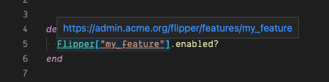
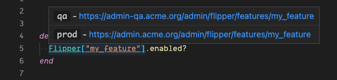

# flipper-follower README

Decorate your `Flipper` features with a link to their admin page

## Features

- Decorates `Flipper["my_feature"]` with an underline
- supports both string and symbol keys
- Adds a hover tooltip with a link to the key admin page
  - link is in the form `"${baseUrl}${key}"` where key in the above example is `my_feature`

Example using `flipper-links.baseUrl`

Example using `flipper-links.environments`

## Extension Settings

This extension contributes the following settings:

- `flipper-links.baseUrl`: the base url from which the links are generated
- `flipper-links.environments`: key value object where the key is environment name and the value is the base url

## Known Issues

The underline decoration for the text obscures underscores within the key. This was fixed for normal links in vscode but the appropriate style option doesn't appear to be available to decoration API.

## Release Notes

### 1.1.0

- Adds support for symbols
- Adds support for multiple environments through `flipper-links.environments` config object

### 1.0.0

Initial release of flipper-links which automatically decorates your flipper features with an underline and adds the link on hover.
