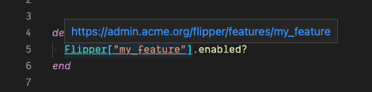

# flipper-follower README

Decorate your `Flipper` features with a link to their admin page

## Features

- Decorates `Flipper["my_feature"]` with an underline
- Adds a hover tooltip with a link to the key admin page
  - link is in the form `"${baseUrl}${key}"` where key in the above example is `my_feature`

## Extension Settings

This extension contributes the following settings:

- `flipper-links.baseUrl`: the base url from which the links are generated

## Known Issues

Currently only one `baseUrl` is supported

## Release Notes

### 1.0.0

Initial release of flipper-links which automatically decorates your flipper features with an underline and adds the link on hover.
